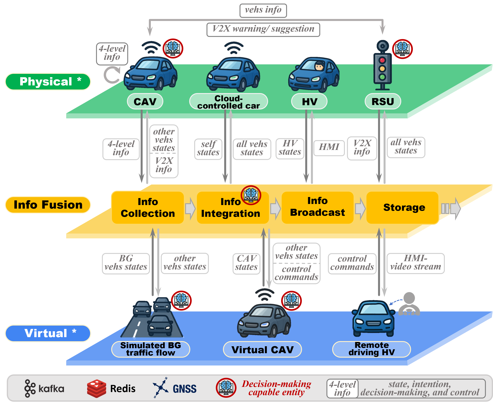

<head>
 
 
</head>

# VPF-ADTP: A Virtual-Physical Fusion Autonomous Driving Testing Platform

**[Yiming Cui](https://tops.tongji.edu.cn/info/1131/1818.htm)**, [Shiyu Fang](https://tops.tongji.edu.cn/info/1033/1190.htm), [Jiarui Zhang](https://tops.tongji.edu.cn/info/1132/1815.htm),[Yan Huang](https://tops.tongji.edu.cn/info/1033/1189.htm), [Peng Hang](https://tops.tongji.edu.cn/info/1031/1383.htm), [Jian Sun](https://tops.tongji.edu.cn/info/1031/1187.htm)  

[Department of Traffic Engineering and Key Laboratory of Road and Traffic Engineering, Ministry of Education, Tongji University](https://tops.tongji.edu.cn/)  

## Abstract

The rapid development of autonomous vehicles has led to a surge in testing demands. Efficient and reliable testing is essential not only for validating and improving algorithm performance but also serves as a prerequisite before deployment and large-scale adoption. However, conventional testing approaches face significant limitations. Purely virtual simulation tests often suffer from discrepancies between the simulated and actual vehicle state updates, as well as unrealistic behaviors of interacting agents. As for field testing, Closed-course testing is constrained by the availability and functionality of the site, while on-road testing is costly, has wide-ranging social impacts, and raises substantial safety concerns.
To overcome the shortcomings of relying solely on virtual simulation or physical testing, we propose an integrated virtual-physical testing platform VPF-ADTP that integrates a full spectrum of virtual and physical elements and covers the complete range of testing requirements. The platform combines physical components—including CAVs, cloud-controlled vehicles, and roadside infrastructure—with virtual components such as simulated CAVs, remote drivers operating via driving simulators, and background traffic flow simulations. Through flexible configuration of virtual and physical elements, the platform supports single-vehicle virtual-physical fusion tests and multi-vehicle virtual-physical fusion tests. The former includes adversarial testing and parallel deduction testing, enabling assessment of algorithmic limits under high-risk edge cases. The latter leverages V2V and V2X communications across vehicles of different automation levels to evaluate cooperative driving capabilities, as well as vehicle-infrastructure cooperation involving roadside facilities.
For evaluation, the platform adopts a multi-dimensional assessment framework to holistically measure the intelligence level of the system under test. It supports customizable metrics and evaluation schemes to meet diverse testing needs and provides targeted insights to guide algorithm enhancement. By comparing virtual-physical testing outcomes with real-world on-road test results, the credibility and reliability of the testing platform itself are also validated from multiple perspectives.

## Key Contributions

Most existing virtual-physical fusion platforms or implementation methods only incorporate a single specific type of physical device, failing to achieve the integration of multiple physical entities within the testing environment or the flexible combination of virtual and physical elements. Consequently, the  frameworks proposed in current studies can only accomplish relatively singular and specific functions, lacking functional integration and a unified workflow for diverse testing requirements. To address these limitations and fully test the performance of algorithm under test (AUT) or vehicle under test (VUT), we propose a Virtual-Physical Fusion Autonomous Driving Testing Platform (**VPF-ADTP**) that integrates all virtual and physical components and covers multiple testing needs. The platform incorporates physical components such as Connected Automated Vehicles (CAVs), cloud-controlled vehicles, and roadside infrastructure, along with virtual components including virtual CAVs, remotely operated vehicles controlled by driving simulators, and simulated background traffic flow. Furthermore, it establishes an integrated information hub for virtual-physical testing with visualization capabilities, supporting comprehensive testing functionalities such as single-vehicle performance and multi-vehicle coordination ability.

The key contributions of our work are summarized as follows:
1. The platform features powerful scene editing capabilities, enabling map modifications and rapid scenario generation through streamlined workflows, which facilitates algorithm migration across different scenarios.
2. It integrates multiple types of physical and virtual components while supporting flexible combinations of virtual-physical elements, thereby fulfilling diverse functional testing requirements.
3. A public evaluation service platform is established with standardized assessment procedures and openly accessible evaluation services, enabling diagnostic analysis and horizontal/vertical comparison of algorithms to provide evidence for algorithmic improvements.

<iframe src="./Figs/Framework-v3.pdf" width="100%" height="600px"></iframe>

## Platform Framework

### Architecture and Components

Overall, all virtual and physical testing resources and components involved in the virtual–physical fusion testing platform are deployed in the **Virtual Environment** and **Physical Environment**, respectively.

From a scenario perspective, the physical test site is equipped with various layouts, including parking lots, straight road segments, intersections, T-junctions, roundabouts, and merging zones. Based on these, the simulation base map in the virtual environment is constructed as a high-definition map by collecting real-world test field data, enabling a one-to-one replication to serve as the geographic foundation of the platform.

From a test-element perspective, the virtual environment can provide controllable virtual background traffic flows, virtual CAVs, and remote-driven HVs, each functionally corresponding to physical CAVs of different automation levels, human-driven HVs, and cloud-controlled intelligent targets in the physical environment. This comprehensive set of traffic participants for autonomous vehicle testing can be flexibly combined to support single-vehicle and multi-vehicle testing. In addition, the physical environment is equipped with roadside infrastructure to support V2I testing requirements.
By integrating vehicle information from both virtual and physical environments, the virtual–physical fusion testing platform enables information transmission and dynamic interaction between virtual–virtual, virtual–physical, and physical–physical vehicles, thereby creating an authentic and credible testing environment.

  
  
Data transmission pipeline of the VPF-ADTP

### Platform Capabilities

By configuring virtual and physical elements on the virtual–physical fusion digital twin platform, two types of testing capabilities can be achieved: single-vehicle virtual–physical fusion testing and multi-vehicle virtual–physical fusion testing.
First, single-vehicle virtual–physical fusion testing includes adversarial testing and parallel deduction testing, enabling the evaluation of autonomous driving system performance in high-risk and edge-case scenarios, as well as the exploration of algorithmic capability boundaries.
Second, multi-vehicle virtual–physical fusion testing leverages V2V and V2X communication to assess collaborative capabilities among vehicles with different levels of automation. This includes evaluating various levels of vehicle–vehicle cooperation, as well as vehicle–infrastructure cooperation involving roadside infrastructure.

Meanwhile, the constructed platform possesses the capability to evaluate both the test results themselves and the credibility of the platform. It employs a multi-dimensional comprehensive evaluation framework to assess the overall intelligence level of the system under test, supporting customizable evaluation metrics and schemes to meet diverse and scenario-specific testing requirements, thereby enabling targeted evaluations to guide algorithm improvement. In addition, by comparing the results of virtual–physical fusion testing with those of real-world road testing, the credibility of the platform itself can be evaluated and validated across multiple dimensions.

## Testing Ability & Corresponding Cases
We systematically presents the testing capabilities supported by the virtual-physical fusion testing platform. These capabilities are categorized into single-vehicle and multi-vehicle virtual-physical fusion testing, with each category elaborating on the corresponding testing objectives, technical implementation methodologies, and representative test cases conducted based on the platform.

### Single-vehicle Virtual-physical Fusion Testing
The proposed VPF-ADTP platform offers two key capabilities for single-vehicle testing. (1) Adversarial testing: adaptively generating adversarial behaviors for surrounding vehicles to rapidly expose the capability boundaries of the Algorithm Under Test (AUT).And (2) parallel deduction testing: when a takeover occurs, running the AUT in parallel to assess whether it could in fact handle the current scenario, thereby identifying and correcting false-positive takeovers.

#### (1) Adversarial Testing
Adversarial testing is a methodology designed to evaluate the performance of the VUT under extreme scenarios by adaptively adjusting opposing strategies based on its real-time behavior. The primary objective is to efficiently expose critical weaknesses that may be difficult to identify through standard testing procedures, thereby more effectively exploring the capability boundaries of the tested algorithms.
However, a notable limitation of existing research is its predominant reliance on purely simulated environments, with a lack of application and validation on real-world vehicle platforms and in physical test conditions. 
Due to the nature of adversarial testing, which explores the boundary of vehicle capabilities, real-world field tests inherently carry certain safety risks. To address this gap, this study incorporates adversarial testing capabilities within the virtual–physical fusion testing platform, fully leveraging both virtual and physical vehicles as adversaries to construct realistic, safe, and efficient adversarial environments.

  <figure>
    <video muted controls width="720">
      <source src="./Videos/AT-4views.mp4" type="video/mp4">
      Your browser does not support the video tag.
    </video>
    <figcaption>Adversarial Testing case</figcaption>
  </figure>

#### (2) Parallel Deduction Testing
During on-road testing of autonomous driving systems, a safety operator is typically assigned to take over control when signs of hazardous or improper behavior are detected. While this intervention ensures testing safety, it also prevents the autonomous system from completing complex scenario tasks; even when the system possesses the capability to handle them, execution may be prematurely terminated. In other words, false-positive takeovers may prevent the AUT’s capability boundaries from being fully evaluated. To address this issue, the platform is equipped with parallel deduction testing capability.

  <figure>
    <video muted controls width="720">
      <source src="./Videos/PD.mp4" type="video/mp4">
      Your browser does not support the video tag.
    </video>
    <figcaption>Parallel deduction testing case</figcaption>
  </figure>

### Multi-vehicle Virtual-physical Fusion Testing
The virtual–physical fusion platform leverages comprehensive virtual and physical elements to build controllable and repeatable cooperative scenarios, and establishes bidirectional low-latency communication along with unified spatiotemporal synchronization, ensuring stable validation of cooperative algorithms. Based on these capabilities, the platform supports both V2V and V2I cooperation testing.

#### (1) Vehicle-vehicle Cooperation Testing
Physical vehicles are equipped with cooperative controllers that support millisecond-level communication latency, enabling real-time sharing of information such as current position, intended trajectory, and upcoming decisions. Given that V2V scenarios often involve a large number of participants while physical vehicle resources are typically limited, the platform also integrates a controllable virtual background traffic flow. This is achieved via a Redis database interface that reads and writes the states and actions of virtual cooperation vehicles in real time, allowing the system to simulate large-scale, high-density cooperative scenarios.Following the SAE J3216 standard and considering the range of variables transmitted in V2V communication, the proposed Vehicle-Vehicle Cooperation Testing framework evaluates four key levels of CDA: state sharing, intention sharing, cooperative decision-making, and cooperative control. 

  <figure>
    <video muted controls width="720">
      <source src="./Videos/v2v-intention.mp4" type="video/mp4">
      Your browser does not support the video tag.
    </video>
    <figcaption>Vehicle-vehicle cooperation with intention sharing testing case</figcaption>
  </figure>

  <figure>
    <video muted controls width="720">
      <source src="./Videos/v2v-decision.mp4" type="video/mp4">
      Your browser does not support the video tag.
    </video>
    <figcaption>Vehicle-vehicle cooperation with cooperative decision-making testing case</figcaption>
  </figure>

#### (2) Vehicle-infrastructure Cooperation Testing
The platform supports flexible configuration and combination of virtual and physical V2I testing elements, enabling the construction of special traffic event scenarios through digital twin technology and the safe, repeatable reproduction of identical testing conditions, thereby overcoming the limitations of uncontrollable events in real-road environments. Physical vehicles, RSUs, MEC edge computing units, cloud control platforms, and virtual background traffic are integrated into a unified testing system, achieving high-precision temporal synchronization of multi-source perception data and bidirectional real-time communication.

  <figure>
    <video muted controls width="720">
      <source src="./Videos/v2i.mp4" type="video/mp4">
      Your browser does not support the video tag.
    </video>
    <figcaption>Vehicle-infrastructure cooperation testing cases</figcaption>
  </figure>

## Appendix

**👉 Please refer to the website for the full testing functionalities[Onsite](https://www.onsite.com.cn/).
**

## Contact

If you have any questions, feel free to contact us (yim211@tongji.edu.cn).
